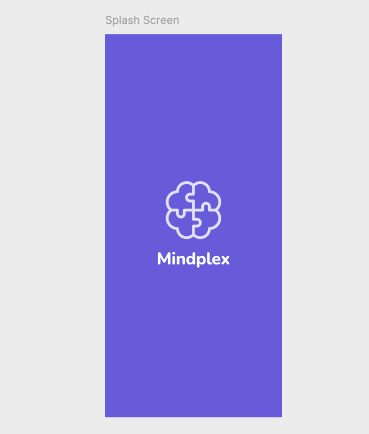

# 💡 Mindplex

<figure><figcaption></figcaption></figure>

Introducing Mindplex, your ultimate quiz app destination! Dive into a world of knowledge with our engaging true/false
questions and multiple-choice quizzes designed to challenge your intellect and entertain you endlessly. Experience the
sleek user interface starting from the splash screen to the intuitive onboarding flow, guiding you seamlessly into the
heart of Mindplex.

Log in effortlessly and explore the main screen, where a world of quizzes awaits. Whether you're in the mood for a quick
true/false challenge or a more extensive multiple-choice quiz, Mindplex has got you covered. Celebrate your victories
and track your progress on the achievements screen, showcasing your journey through the realms of knowledge.

Personalize your experience on the profile screen, where you can customize your avatar and display your quiz conquests.
With Mindplex, you're not just playing a game; you're embarking on a journey of learning and fun. So why wait? Check
Mindplex now and start your quiz adventure today!

<figure><figcaption></figcaption></figure>

## 📁 Development Conventions

#### Branching

* **`master`**: The main branch where all changes are merged after a Pull Request (PR) is approved. This branch should
  always have a working functionality.
* **`MPMP-[N]-feature-name`**: Branches for developing individual features or tasks. `[N]` is replaced by the ticket
  number, and `feature-name` is a brief description of the functionality. For example, for task number 1 related to
  Gradle configuration, the branch would be named `MPMP-1-gradle-configuration`.

#### Commits

* **`MPMP-[N]: [commit-gist] (#[N])`**: The format for commit messages, where `[N]` is the ticket number,
  and `[commit-gist]` is a brief description of the changes. For example, for a commit related to Gradle configuration
  in task number 1, the message would look like this: `MPMP-1: Configured gradle (#1)`.

#### Pull Requests (PR)

* For all PRs on GitHub, it is necessary to use `squash commit` to combine all commits into one before merging into the
  main branch. This helps keep the change history clean and organized.

#### General Recommendations

* Try to make commits atomic, i.e., each commit should contain a logically complete change.
* Before creating a PR, make sure your branch is up to date with the main branch (`master`) and perform a rebase if
  necessary.
* The PR should clearly describe the changes being made and, if necessary, provide screenshots or other evidence of the
  functionality.

Following these rules will help maintain order in the repository and facilitate collaborative work on the project.

## 🚀 Technologies Used

* Kotlin
* Jetpack Compose Multiplatform
* Koin
* Decompose
* Multiplatform view-lifecycle

## 📱 Features

### Onboarding

#### Figma: [Onboarding screens](https://www.figma.com/file/iI2ctMyZwWFNMbFcYsbk9q/Mindplex?type=design\&node-id=0-460\&mode=design\&t=27bRTu2XvkRIwMDj-4)

<figure><figcaption></figcaption></figure>

***

<mark style="color:green;">**AC1:**</mark> Corresponds to Figma designs.

<mark style="color:green;">**AC2:**</mark> Shown to the user only once, provided that they have viewed all three screens
or pressed 'Skip'.

<mark style="color:green;">**AC3:**</mark> 'Skip' redirects the user to the home screen.

<mark style="color:green;">**AC4:**</mark> 'Next' redirects the user to the following onboarding screen.

<mark style="color:green;">**AC5:**</mark> A dot indicator should be implemented to show the user which of the three
screens they are currently on.

<mark style="color:green;">**AC6:**</mark> User-friendly animation transitions between screens should be implemented.

<mark style="color:yellow;">**OAC7**</mark>**:** User-friendly animations for images, text, indicators, and buttons
should be implemented.

